# Skymmich Architecture

**Version:** 0.9.2
**Last Updated:** 2026-04-10

---

## Table of Contents

- [System Overview](#system-overview)
- [Monorepo Structure](#monorepo-structure)
- [Frontend Architecture](#frontend-architecture)
- [Backend Architecture](#backend-architecture)
- [Data Layer](#data-layer)
- [Real-Time Communication](#real-time-communication)
- [External Integrations](#external-integrations)
- [Background Processing](#background-processing)
- [Deployment & Infrastructure](#deployment--infrastructure)
- [CI/CD Pipeline](#cicd-pipeline)
- [Security Considerations](#security-considerations)

---

## System Overview

Skymmich is a full-stack astrophotography management platform built with TypeScript. It integrates with Immich (self-hosted photo library) and Astrometry.net (plate solving service) to enrich astrophotography images with astronomy-specific metadata, equipment tracking, target planning, and sky mapping.

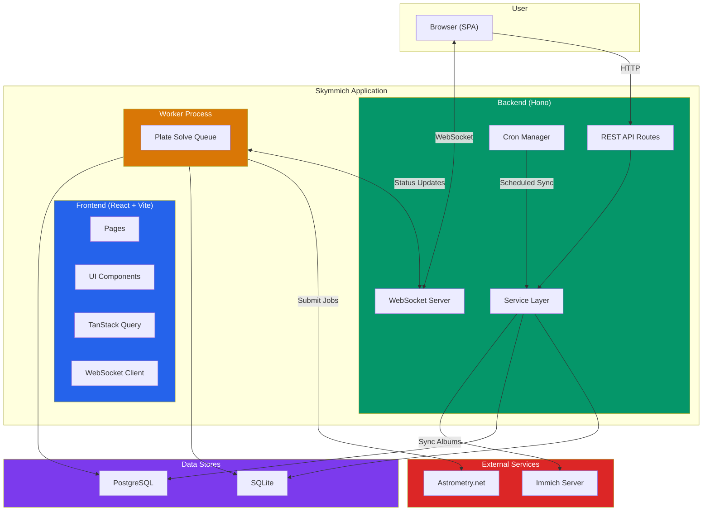

---

## Monorepo Structure

The project is organized as a monorepo with clear separation between frontend, backend, and shared packages.

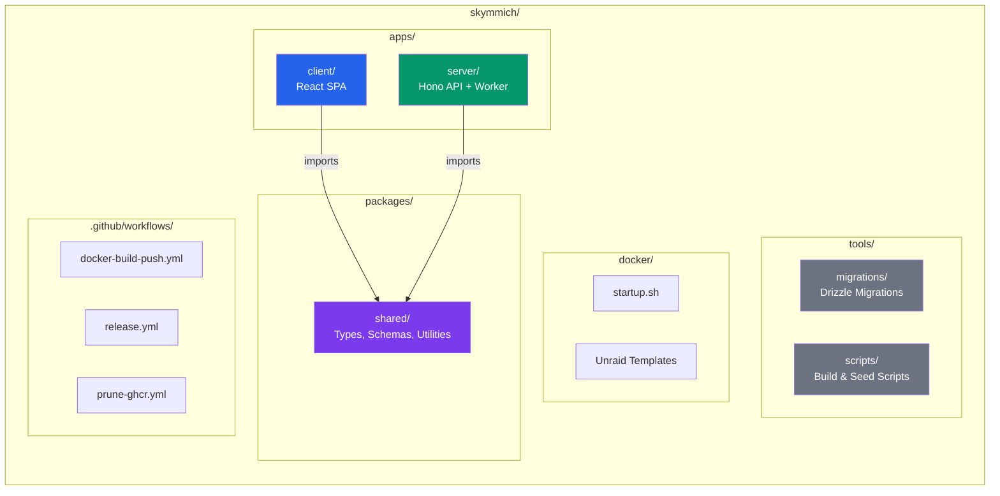

### Key Directories

| Path | Purpose |
|------|---------|
| `apps/client/` | React SPA — pages, components, hooks, API clients |
| `apps/server/` | Hono HTTP server — routes, services, workers |
| `packages/shared/` | Drizzle schemas (dual PG/SQLite), Zod validation, shared types & utilities |
| `tools/migrations/` | Drizzle-managed database migrations |
| `tools/scripts/` | Build helpers, database seeding |
| `docker/` | Container startup script, platform templates |

---

## Frontend Architecture

The frontend is a React 19 single-page application built with Vite, using a component-driven architecture with server state management via TanStack Query.

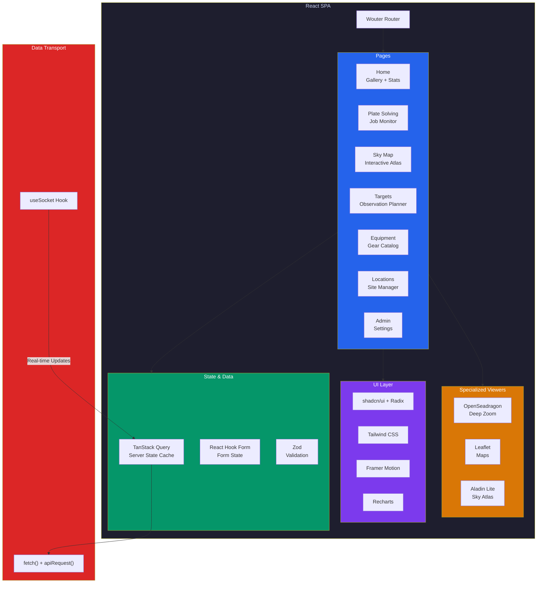

### Data Flow Pattern

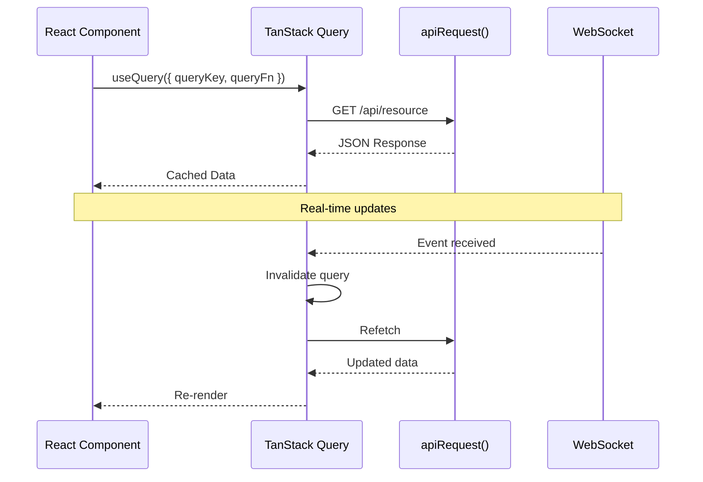

### Key Frontend Technologies

| Library | Role |
|---------|------|
| React 19 + Vite 8 | Core framework and build tool |
| Wouter | Lightweight client-side routing |
| TanStack Query | Server state caching, deduplication, background refetch |
| React Hook Form + Zod | Form state management with schema validation |
| shadcn/ui + Radix | Accessible, composable UI primitives |
| Tailwind CSS | Utility-first styling |
| OpenSeadragon | Deep zoom for high-resolution astro images |
| Leaflet | Interactive maps for observation locations |
| Aladin Lite | Embedded sky atlas for celestial visualization |
| Recharts | Data visualization and statistics charts |

---

## Backend Architecture

The backend is a Hono HTTP server running on Node.js. It follows a layered architecture: routes handle HTTP concerns, services encapsulate business logic, and a shared storage layer abstracts the database.

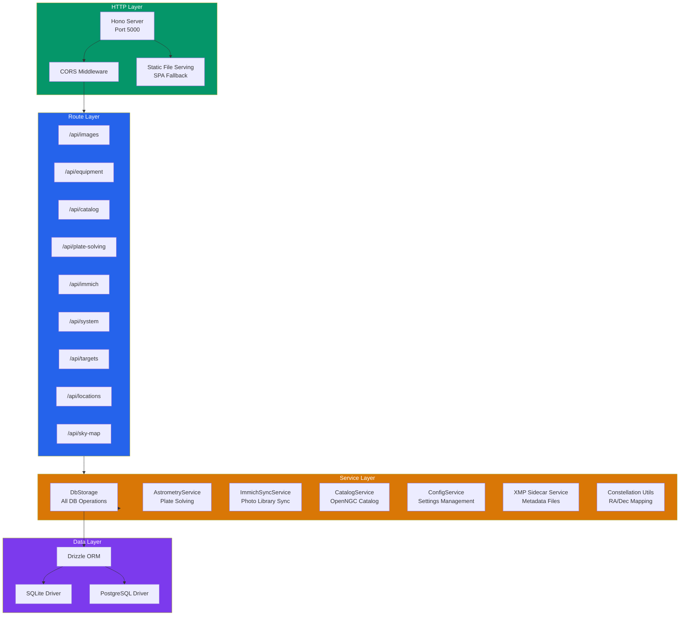

### API Route Summary

| Route | Purpose |
|-------|---------|
| `GET/PATCH /api/images` | Image listing with filters, metadata updates |
| `POST /api/plate-solving/images/:id/plate-solve` | Submit image for plate solving |
| `GET/POST /api/immich/sync` | Immich album sync and connection testing |
| `CRUD /api/equipment` | Equipment catalog management |
| `CRUD /api/equipment-groups` | Equipment grouping by type |
| `GET /api/catalog` | OpenNGC deep-sky object search |
| `CRUD /api/targets` | Observation target planning |
| `CRUD /api/locations` | Observation site management |
| `GET /api/sky-map` | Sky map data (constellation boundaries) |
| `GET/POST /api/system/settings` | Admin configuration, health checks |

### Service Responsibilities

| Service | Responsibility |
|---------|---------------|
| **DbStorage** | All database CRUD — images, equipment, jobs, settings, notifications |
| **ConfigService** | Three-tier config resolution: env vars > DB settings > defaults |
| **AstrometryService** | Astrometry.net API integration, job lifecycle, result parsing |
| **ImmichSyncService** | Album fetching, photo matching, metadata sync back to Immich |
| **CatalogService** | OpenNGC catalog lazy loading, search, and caching |
| **XMP Sidecar** | Generate EXIF/XMP metadata files alongside images |
| **WsManager** | WebSocket connection management and broadcasting |
| **CronManager** | Scheduled job orchestration |

---

## Data Layer

Skymmich supports dual databases via Drizzle ORM with synchronized schemas — SQLite for simplicity and PostgreSQL for scale.

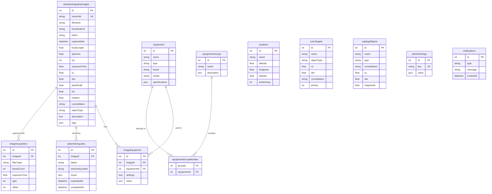

### Dual Database Strategy

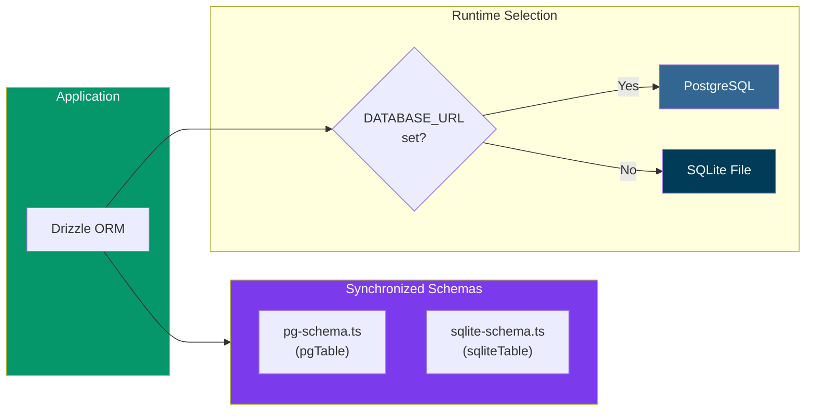

- **SQLite** (default): Zero-config, file-based at `/app/config/skymmich.db`. Ideal for single-user or low-traffic setups.
- **PostgreSQL** (optional): Enabled by setting `DATABASE_URL`. Recommended for multi-user or high-volume deployments.
- **Migrations**: Managed by Drizzle Kit. Applied automatically on server startup.

---

## Real-Time Communication

WebSocket connections provide real-time updates for long-running operations like plate solving and Immich sync.

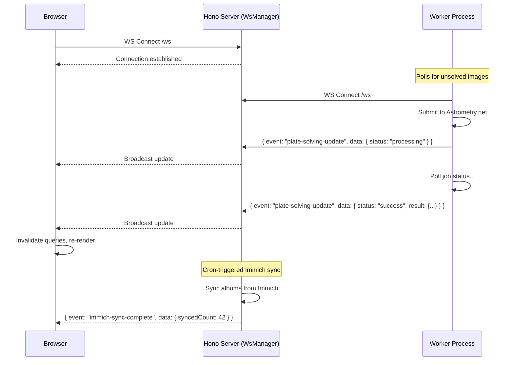

### Event Types

| Event | Source | Payload |
|-------|--------|---------|
| `plate-solving-update` | Worker | `{ jobId, status, result }` |
| `immich-sync-complete` | Cron Manager | `{ success, message, syncedCount, removedCount }` |

### Client Connection Management

- Singleton WebSocket manager with reference counting
- Automatic reconnection with exponential backoff (1s to 30s max)
- Page-level hooks (`usePlateSolvingUpdates`, `useImmichSyncUpdates`) manage subscriptions

---

## External Integrations

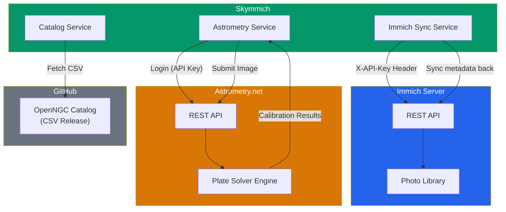

### Immich Integration

- **Sync Direction**: Bidirectional — pulls images from Immich, pushes enriched metadata back
- **Path Mapping**: Translates Immich internal paths (`/usr/src/app/upload`) to local mount paths (`/immich-upload`)
- **Scheduled Sync**: Runs every 4 hours via cron (configurable)
- **Authentication**: API key passed via `X-API-Key` header

### Astrometry.net Integration

- **Flow**: Login (API key) -> Submit image (URL or file upload) -> Poll job status -> Parse calibration results
- **Results**: RA/Dec coordinates, pixel scale, field of view, rotation angle, constellation, annotations
- **Output**: Results stored in DB, written to XMP sidecar files, synced back to Immich

### OpenNGC Catalog

- Lazily loaded from GitHub releases (CSV format)
- Cached in the database for fast search
- Provides NGC/Messier/IC object details, coordinates, magnitudes

---

## Background Processing

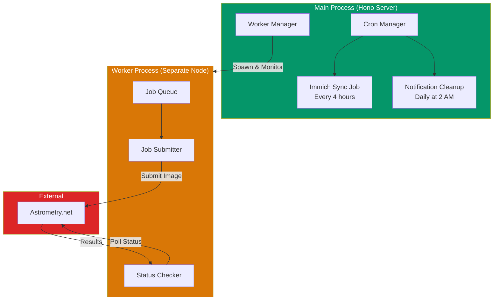

### Worker Process

- Runs as a **separate Node.js process** spawned by `WorkerManager`
- Queries the database for unsolved images on a polling interval
- Submits to Astrometry.net with configurable concurrency (default: 3 concurrent jobs)
- Reports progress via WebSocket connection to the main server
- Auto-restarts on crash (exponential backoff, max 5 attempts)
- Can run in **standalone mode** using environment variables only (no DB config)

### Cron Jobs

| Job | Schedule | Purpose |
|-----|----------|---------|
| Immich Sync | `0 */4 * * *` (every 4h) | Pull new images, sync metadata back |
| Notification Cleanup | `0 2 * * *` (daily 2 AM) | Prune notifications older than 30 days |

---

## Deployment & Infrastructure

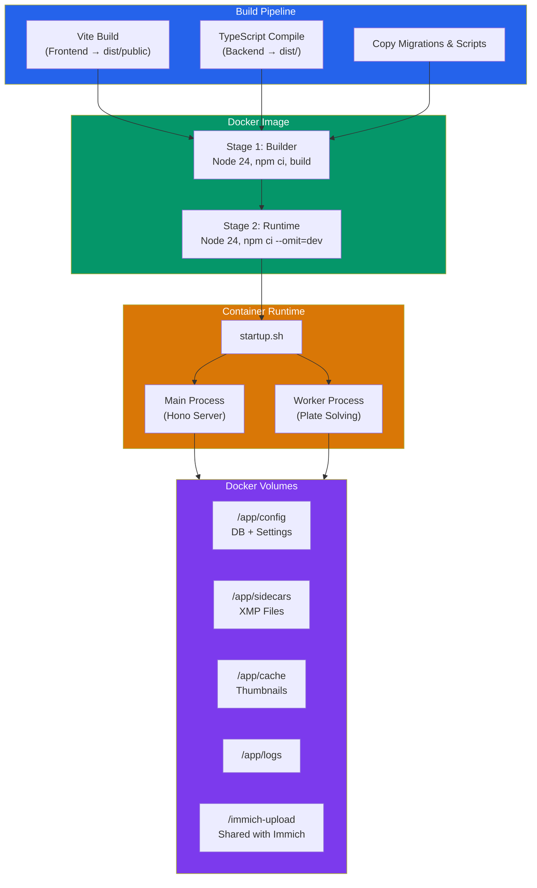

### Docker Compose Configurations

| File | Database | Use Case |
|------|----------|----------|
| `docker-compose.yml` | SQLite | Default — single container, no dependencies |
| `docker-compose.postgres.yml` | PostgreSQL | Override — adds postgres service |
| `docker-compose.prod.yml` | SQLite | Production variant with additional configs |

### Container Details

- **Base Image**: Node 24 (multi-stage build)
- **Non-root User**: `skymmich` (UID 1001)
- **Health Check**: `curl http://localhost:5000/api/health`
- **PUID/PGID Remapping**: Supports Unraid-style user mapping
- **Multi-arch**: Builds for `amd64` and `arm64`
- **Startup Script**: Handles DB readiness, migrations, process management, and graceful shutdown

### Key Environment Variables

| Variable | Purpose | Default |
|----------|---------|---------|
| `PORT` | Server port | `5000` |
| `DATABASE_URL` | PostgreSQL connection string | _(unset = SQLite)_ |
| `SQLITE_DB_PATH` | SQLite file location | `/app/config/skymmich.db` |
| `XMP_SIDECAR_PATH` | XMP output directory | `/app/sidecars` |
| `IMMICH_MAPPING_PATH` | Immich internal path prefix | `/usr/src/app/upload` |
| `LOCAL_MAPPING_PATH` | Local mount equivalent | `/immich-upload` |
| `ENABLE_PLATE_SOLVING` | Enable worker process | `true` |

---

## CI/CD Pipeline

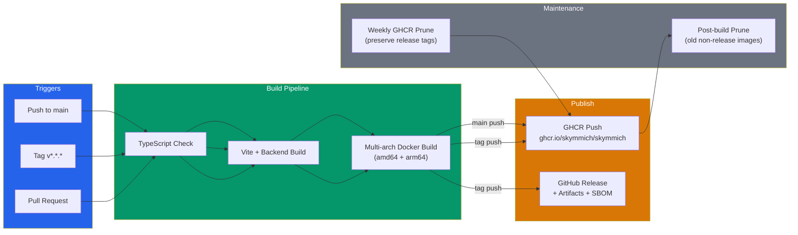

### Docker Image Tags

| Trigger | Tags Applied |
|---------|-------------|
| Push to main | `main`, `sha-<commit>`, timestamp |
| Version tag (e.g., `v0.9.2`) | `latest`, `0.9.2`, `0.9`, `0` |

---

## Security Considerations

### API Key Management

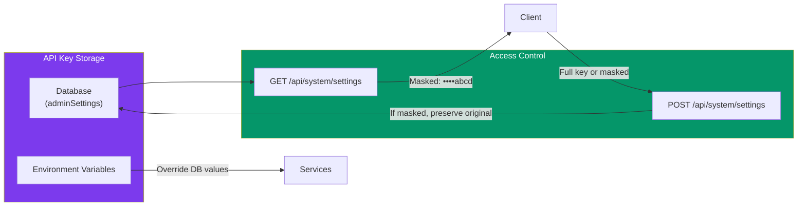

- **No user authentication**: Single-user application (designed for self-hosted use)
- **API key masking**: Keys are redacted in API responses (only last 4 characters shown)
- **Preservation on save**: If a masked key is submitted back, the server preserves the original
- **Non-root container**: Runtime user is `skymmich` (UID 1001)
- **URL validation**: Immich host validated as proper HTTP/HTTPS URL
- **External auth**: Astrometry.net uses session tokens; Immich uses `X-API-Key` header

---

## Request Lifecycle

End-to-end flow for a typical user interaction — viewing and plate-solving an image:

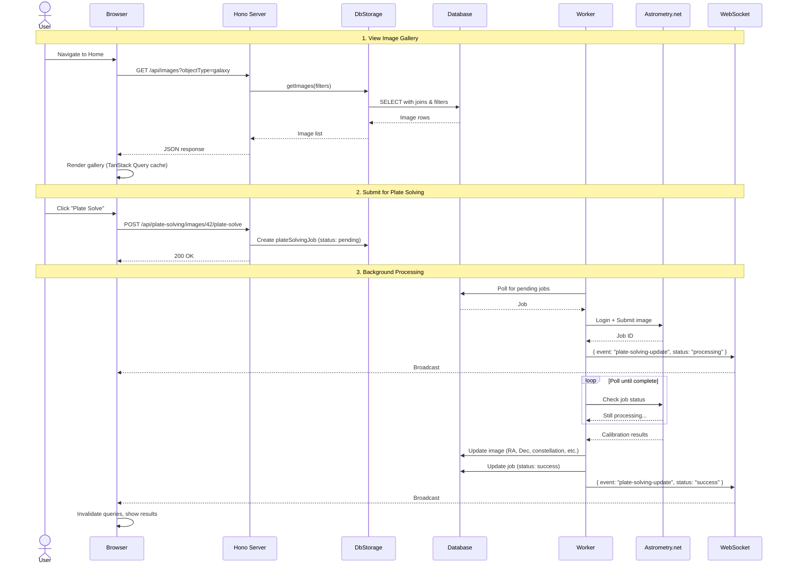
